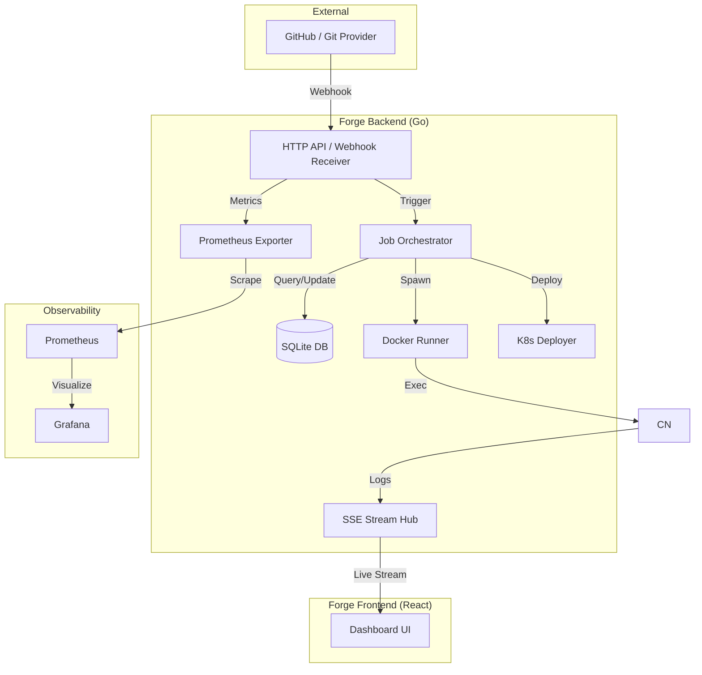
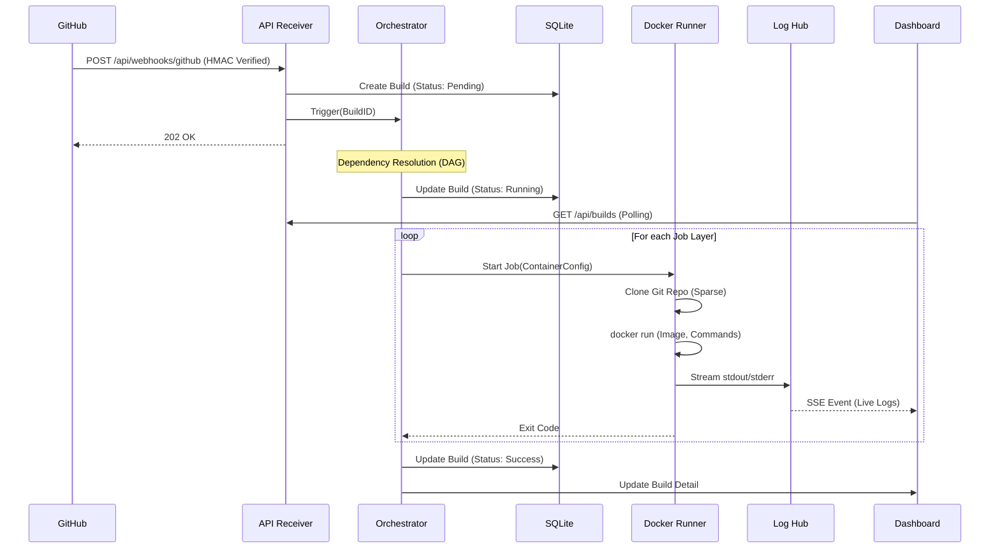

# Architecture Documentation

Forge is a self-hosted CI/CD system designed for simplicity, isolation, and speed. This document outlines the internal mechanics and data flows.

## High-Level Architecture

The system consists of a Go backend that manages the orchestrator and API, and a React frontend for the dashboard.



## Execution Flow (Sequence)

This diagram shows the sequence of events from a code push to a successful deployment.



## Data Model

Forge uses SQLite via GORM to maintain state:

1.  **Pipeline**: Stores repository URL, credentials, and webhook secrets.
2.  **Build**: Represents a single execution of a pipeline (triggered by Git or Manual).
3.  **Job**: An individual unit of work defined in `.forge.yml`. Belongs to a Build.
4.  **LogLine**: Historical log lines stored for finished builds.

## Key Components

### 1. Webhook Receiver (`internal/api`)
Validates incoming payloads using the `X-Hub-Signature-256` header to ensure only your Git provider can trigger builds.

### 2. DAG Orchestrator (`internal/engine`)
Parses the `.forge.yml` file and builds a Directed Acyclic Graph (DAG) based on the `needs:` keyword. It ensures jobs are run in the correct order and parallelizes jobs that have no shared dependencies.

### 3. Docker Runner (`internal/engine/runner.go`)
Communicates with the Docker Engine via the SDK. It:
- Pulls images.
- Creates a temporary workspace volume.
- Injects environment variables.
- Executes steps as a combined shell script.

### 4. SSE Stream Hub (`internal/stream`)
A thread-safe pub/sub system. When a container writes a log line, the Hub broadcasts it to all connected frontend clients via Server-Sent Events.

### 5. K8s Deployer (`internal/engine/deploy.go`)
Uses `client-go` to apply YAML manifests. It performs automatic image tag substitution (searching for `${{ git.sha }}` or similar placeholders) before applying to the cluster.

---

## Internal Logic: Job Execution Script

When the Docker Runner starts a job, it doesn't just run individual commands. It generates a **combined shell script** to ensure environment consistency and failure propagation.

The generated script follows this pattern:
```bash
#!/bin/sh
set -e # Exit on first error

# 1. Export Environment Variables
export GO_VERSION="1.23"
export APP_ENV="production"

# 2. Workspace Setup
mkdir -p /workspace && cd /workspace

# 3. Sequential Steps
echo "--- Step: Unit Tests"
go test ./...

echo "--- Step: Build Binary"
go build -o app .
```

This script is then piped into the container's entrypoint (usually `/bin/sh`).

---

## Onboarding for New Developers

If you are new to the Forge codebase, here is the recommended exploration path:

1.  **The API Layer**: Start at `internal/api/webhook.go`. This is where builds are born.
2.  **The Heart**: Look at `internal/engine/orchestrator.go`. It handles the job queue and the "Needs" dependency resolution.
3.  **The Worker**: Check `internal/engine/runner.go`. This is where Go talks to Docker.
4.  **The Stream**: See `internal/stream/hub.go`. Understand how `io.Writer` from Docker is turned into SSE events.
5.  **The Frontend**: Explore `web/src/pages/BuildDetail.tsx`. See how it connects to the SSE hub for real-time logs.

### Key Tools Used
- **GORM**: Database ORM (SQLite).
- **Chi**: Lightweight HTTP router.
- **Docker SDK**: Native Go bindings for Docker.
- **Client-Go**: Official Kubernetes client.
- **Vite**: Frontend build tool.
