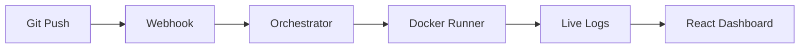

# Forge

> **Self-hosted, Docker-powered CI/CD System.**  
> Trigger builds from Git events, execute jobs in isolated containers, and deploy to Kubernetes with ease.

[](https://goreportcard.com/report/github.com/0xdaksh-12/Forge)


---

## Features

- **Full Observability** — Built-in Prometheus metrics and Grafana dashboards.
- **Live Log Streaming** — Watch your builds in real-time via Server-Sent Events (SSE).
- **Isolated Docker Execution** — Every job runs in a clean, disposable container.
- **DAG-based Pipelines** — Orchestrate complex workflows with job dependencies (`needs:`).
- **Kubernetes Native** — Built-in support for manifest deployment with automatic image tagging.
- **Artifact Storage** — Automatically persist build outputs (binaries, reports) and download securely via S3.
- **Secure by Default** — HMAC-SHA256 webhook validation and token-based API auth.
- **Modern Dashboard** — Sleek dark-mode UI built with React and Material Design.

---

## Project Structure

```text
.
├── cmd/forge             # Backend Entry Point
├── internal/
│   ├── api/              # REST API & Webhook Handlers
│   ├── engine/           # DAG Orchestrator & Docker Runner
│   ├── db/               # SQLite / GORM Models
│   ├── stream/           # SSE Log Streaming Hub
│   └── git/              # Repository Cloning Logic
├── web/                  # React + Vite Frontend
│   ├── src/pages/        # Dashboard, Pipelines, Build Details
│   └── src/api/          # Typed Fetch Client
├── ARCHITECTURE.md       # Detailed Mermaid diagrams & flow charts
└── docker-compose.yml    # Production-ready deployment
```

---

## Quick Start

### 1. Run via Docker (Recommended)

```bash
docker compose up -d
# Access dashboard at http://localhost:8080
# Default Token: forge-secret
```

### 2. Manual Installation

```bash
# Clone and build
git clone https://github.com/0xdaksh-12/Forge.git && cd Forge
make build

# Start server
export FORGE_API_TOKEN=your-secret
./bin/forge
```

---

## Pipeline Configuration (.forge.yml)

Place a `.forge.yml` in your repo root. Forge supports dependencies and environment variables.

```yaml
name: my-app
on:
  push: { branches: [main] }

jobs:
  test:
    image: golang:1.23-alpine
    steps:
      - name: Unit Tests
        run: go test ./...

  build:
    image: docker:latest
    needs: [test]
    steps:
      - name: Build & Push
        run: |
          docker build -t registry.io/app:${{ git.sha }} .
          docker push registry.io/app:${{ git.sha }}
          echo "Done!" > build-report.txt
    artifacts:
      - "build-report.txt"
  deploy:
    needs: [build]
    deploy:
      type: kubernetes
      manifest: k8s/deployment.yaml
      image_tag: ${{ git.sha }}
```

---

## Observability

Forge comes pre-configured with a modern observability stack.

### Accessing Metrics

- **Prometheus UI**: [http://localhost:9090](http://localhost:9090)
- **Grafana Dashboard**: [http://localhost:3000](http://localhost:3000)

### Custom Metrics

Forge exports several custom metrics to help you monitor build health:

- `forge_active_builds`: Current running build count.
- `forge_queue_depth`: Number of builds waiting for a worker.

---

## Architecture

Forge follows a modular architecture where the **Orchestrator** manages the lifecycle of a build by spawning **Docker Runners**.



See [ARCHITECTURE.md](ARCHITECTURE.md) for full sequence diagrams and component details.

---

## Development

### Backend (Go)

```bash
go mod download
go run ./cmd/forge
```

### Frontend (React)

```bash
cd web
pnpm install
pnpm dev
```

### Full Stack Dev

```bash
make dev  # Runs both with HMR and Proxy
```

---

## Contributing

1. Fork the repo.
2. Create your feature branch (`git checkout -b feature/amazing-thing`).
3. Commit your changes (`git commit -m 'Add amazing thing'`).
4. Push to the branch (`git push origin feature/amazing-thing`).
5. Open a Pull Request.

---

## License

Distributed under the `Apache 2.0` License. See `LICENSE` for more information.
